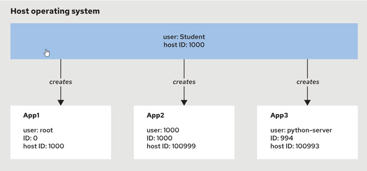

### Rootless Containers


Container technology allows developers to break down application tiers (like the backend) into smaller microservices.
Since containers share the host OS kernel and use fewer resources than VMs, a single host can run many containers
efficiently. However, this density increases risk — compromising one container could affect the entire host. To reduce
this risk, developers follow the principle of least privilege to limit access and minimize attack surfaces.

### Analyzing Rootless Containers

Rootless containers, or unprivileged containers, are containers that do not require administrator privileges.

**A container is rootless only when it meets the following conditions:**

- The containerized process does not use the root user, which is a special privileged user in Linux and UNIX systems.
  Such a user is for administrative purposes and has the ID 0.

- The root user inside of the container is not the root user outside of the container.   
  IF this would not be enforced, then if user mapping is not used, the container would be able to access host resources
  as root.)

- The container runtime does not use the root user. For example, if your container runtime runs as the root user, then
  containers managed by such runtime are not rootless containers.

#### **Rootful vs Rootless Containers**

| Feature      | **Rootful**                                 | **Rootless**                            |
|--------------|---------------------------------------------|-----------------------------------------|
| Runs As      | **Root user**                               | **Non-root user**                       |
| Security     | Higher risk (has full system access)        | Safer (no root privileges on host)      |
| Setup        | Default setup (needs sudo)                  | Requires user namespaces & config       |
| Port Binding | Can bind to **<1024** ports (e.g., 80, 443) | Can only bind to **high ports** (>1024) |
| Storage      | `/var/lib/containers`                       | `$HOME/.local/share/containers`         |
| Use Cases    | System-wide services, legacy tools          | Dev/test environments, CI/CD pipelines  |

### 🔐 Key Differences

* Rootful = More powerful, more dangerous
* Rootless = More secure, but limited capabilities

### ✅ Commands

* Use `podman` as non-root for **rootless containers**:

  ```bash
  podman run -it nginx
  ```

* For **rootful**:

  ```bash
  sudo podman run -it nginx
  ```

* Use `podman info` to verify rootless vs rootful:

  ```bash
  podman info | grep -i rootless
  sudo podman info | grep -i rootless
  ```

#### Permission Denied (Unprivileged user)

In rootless Podman, ports **below 1024 (like port 80)** are privileged and cannot be bound directly by non-root users.

> ✅ Solution: Use a higher port like 8080:80:

```
$ podman run -dit -p 8080:80 nginx
```

---

### User Mapping on rootless containers



Podman guarantees that the root user inside the rootless container does not have root privileges on the host by using
User Mapping.

Consider the following situation for (logged in) host user 'student' (ID 1000):

```
[student@host ~]$ cat /etc/subuid /etc/subgid
student:100000:65536
student:100000:65536
```

The student user can allocate 65536 user IDs starting with the ID 100000.    
This leads to the HostUserID = 100000 + ContainerUserID - 1 ID mapping.   
Consequently, user ID 1 in a container maps to the host user ID 100000, and so on.

The container user ID 0 (root) is an exception, because the root user maps to the user ID that started the container.  
For example, if a user with the ID 1000 starts a container that uses the root user, then the root user maps to the host user ID 1000.

##### 1. **Starting rootless container but root within container**

Checking userID within the container:

```
(host) $ podman run -it registry.access.redhat.com/ubi9/ubi bash  # started container with ID e6116477c5c9 with root in container
(container) $ id
uid=0(root) gid=0(root) groups=0(root)
```

Checking (running) container hostuser, user, uid:

```
(host) $ podman top e6116477c5c9 huser user
(container) $ id
HUSER       USER
1000        root  # HUSER shows UID of user logged in on host.
```

##### 2. **Starting rootless container, not root within container, assigning username to container**

build/start container using Containerfile with explicit username being set:

```
FROM registry.access.redhat.com/ubi9/ubi
USER 994
CMD ["python3", "-m", "http.server"]
```

Checking userID within the container now yields: 994  
Checking (running) container user mapping from host now yields huser 100993, container user(-name) 994.

##### 3. **Starting rootless container, not root within container, assigning USER to container**

build/start container using Containerfile without explicit UID being set:

```
FROM registry.access.redhat.com/ubi9/ubi
RUN adduser --no-create-home --system --shell /usr/sbin/nologin python-server  # UID 1000 will be set by framework
USER python-server
CMD ["python3", "-m", "http.server"]
```

Checking userID within the container now yields: 1000  
Checking (running) container user mapping from host now yields huser 100999, container user(-name) python-server.

### Example

#### 🧪 **Hands-On: Run Rootless Podman NGINX with SELinux Volume**

##### 1. **Enable and Start Podman Service**

```bash
systemctl --user enable --now podman.socket
systemctl --user status podman.socket
```

> 📌 For **rootless**, use `--user` with `systemctl`.

##### 2. **Create a New User**

```bash
sudo useradd strangerthings
sudo passwd strangerthings
```

> 🔑 Set any password you prefer when prompted.

##### 3. **Login as the New User**

```bash
su - strangerthings
```

##### 4. **Create a Directory for Website Content**

```bash
mkdir ~/nginx-data
```

##### 5. **Fix Permissions (chown inside user namespace)**

```bash
podman unshare chown -R $(id -u):$(id -g) ~/nginx-data
```

> This ensures the container can access the directory in rootless mode.

##### 6. **Create a Sample HTML Page**

```bash
echo "Welcome to the upside-down!" > ~/nginx-data/index.html
```

##### 7. **Check SELinux Status**

```bash
sestatus
```

> Ensure SELinux is `enforcing`. If it's disabled, skip the `:z` step.

##### 8. **Run NGINX Container with Volume Mount**

```bash
podman run -d \
  -p 9000:80 \
  -v ~/nginx-data:/usr/share/nginx/html:Z \
  nginx
```

> 🔁 `:Z` applies a **private SELinux label** so NGINX can access the volume.

##### 9. **Verify It’s Working**

```bash
curl http://localhost:9000
```

> You should see: `Welcome to the upside-down!`

---

#### 🛠️ Bonus: SELinux Label Check (Optional)

```bash
ls -Z ~/nginx-data
```

If SELinux blocks access, manually add context:

```bash
sudo semanage fcontext -a -t container_file_t '/home/strangerthings/nginx-data(/.*)?'
sudo restorecon -Rv ~/nginx-data
```

---

### Running Podman containers / pods as systemd services – rootlessly and automatically on boot.

#### Why Use systemd with Podman?

In traditional Linux, services like `nginx`, `postgresql`, or `httpd` are run using `systemctl`.

Similarly, you can **run your containers/pods as services** using `systemd` — even **without root**.

#### How to Set It Up (rootless systemd service) 

#### Generate systemd unit file

```bash
$ podman generate systemd --name <container-name or pod-name> --files
```

📌 Example:

```bash
$ podman generate systemd --name web --files
```

This creates:

```
./container-<container-name>.service # also when when creating a service for a pod
./pod-<pod-name>.service # only when creating a service for a pod

```

You should **move this file to** your systemd user service directory (or have it generated there directly):

```bash
$ mkdir -p ~/.config/systemd/user
$ mv container-web.service ~/.config/systemd/user/
```

#### Reload systemd to recognize new service

```bash
$ systemctl --user daemon-reload
```

#### Start/enable your container/pod as a service

```bash
$ systemctl --user start container-<container-name>.service
$ systemctl --user enable container-<container-name>.service # for container
$ systemctl --user enable --now pod-<pod-name>.service # for pod
```

Check if service is running:

```bash
$ systemctl --user list-units --type=service --state=running
```   

#### Stop / remove your container/pod as a service

```bash
$ systemctl --user stop container-<container-name>.service # for container
$ systemctl --user disable container-<container-name>. # for container
$ rm ~/.config/systemd/user/container-<container-name>.service # for container

$ systemctl --user stop pod-<pod-name>.service # for pod
$ systemctl --user disable pod-<pod-name>.service # for pod
$ rm ~/.config/systemd/user/pod-<pod-name>.service # for pod
```
reload systemd, list services to check that it's removed.

##### ✅ Notes:

* `--user` makes it a **rootless** systemd service (for your user only).
* If you log out, by default the container will stop too.

---

### 🧷 Make Container Start Even After Logout or Reboot

By default, user services run **only when you're logged in**.

To run them on boot **regardless of login**, enable **linger**:

```bash
$ loginctl enable-linger <your-username>
```

Now the system will:

* Start your container at **system boot**
* Keep it running even after you log out

To disable:

```bash
$ loginctl disable-linger <your-username>
```

---


